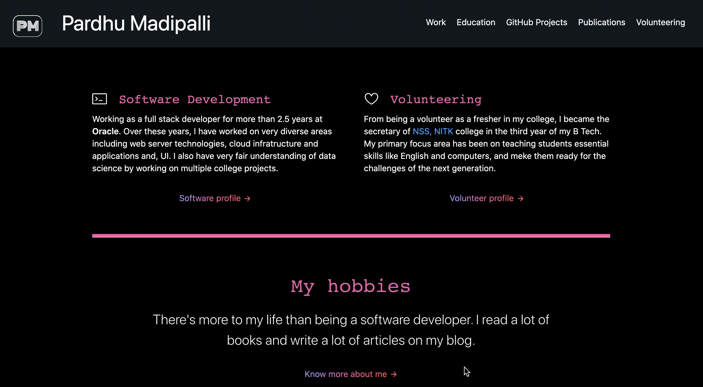

<h1> Hi</h1>

Thanks for showing interest in my profile!

### ⚡ Experienced in
- Building cloud native products that include
    - designing end-to-end cloud service
    - provisioning cloud infrastructure such as networking, file systems, compute etc.
    - implementing control-plane using cloud services like **kubernetes**, **docker**
    - managing entire infrastructure using **Terraform**
    - maintain CI/CD pipelines that can deliver the implemented code to customers within hours
- Java web services
- BigData tools like Kafka and Apache Spark 
- Machine Learning

### 🔭 Can code expertly in
- Java
- Python
- Terraform
- Javascript
- Terraform
- Bash
- C

### ✨ Professionally interested in developing
- Cloud based products
- Java applications

### 👯 Programming Hobbies 
- desingning personal websites or blogs
- providing useful sample OpenSource applications code via GitHub
- working on Machine Learning projects

<h4>Learn more about my work and personal details here: <a href="https://pardhumadipalli.github.io">Pardhu Madipalli GitHub IO</a></h4>
 

 

Take a look at my pinned repositories below and mail me if you are interested in collaborating on any project.

Cheers 😄

<!--
**PardhuMadipalli/PardhuMadipalli** is a ✨ _special_ ✨ repository because its `README.md` (this file) appears on your GitHub profile.

Here are some ideas to get you started:

- 🔭 I’m currently working on ...
- 🌱 I’m currently learning ...
- 👯 I’m looking to collaborate on ...
- 🤔 I’m looking for help with ...
- 💬 Ask me about ...
- 📫 How to reach me: ...
- 😄 Pronouns: ...
- ⚡ Fun fact: ...
-->
